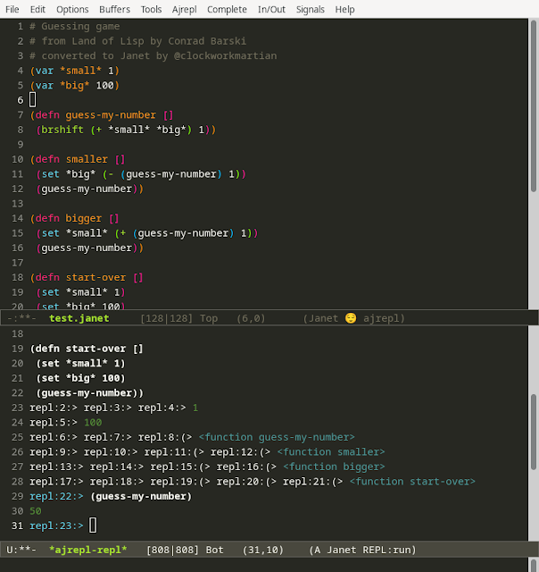

I've been thinking a lot about Lisp the last couple of weeks. I haven't gotten a lot of time for personal projects but it's been on my mind and I've been reading old posts on Hackernews and Reddit and other places and thinking about it in relation to my recent interest in Janet. I had an AI class in college where we used [PAIP](https://en.wikipedia.org/wiki/Paradigms_of_AI_Programming) and Common Lisp for some projects and at the time I couldn't really understand what the fuss about Lisp was about. I found it difficult to read and understand. The concept seemed simple but at the time perhaps my maturity as a developer or the tools we were using just couldn't seem to break the ice for me. I remember using some old IDE tooling by maybe Franz or something (Allegro?) and just not clicking with me. All the text was black and white and there was no syntax highlighting.

Anyway, recently I've been revisiting all these ideas and asking myself: What is so great about Lisp and should I go back and learn some of it to try and experience the magic people talk? Lisp supposedly has an amazing incremental development experience where you can build up code, send it incrementally to the repl, and test it as you go. It also has this built-in debugger that you jump into when an error happens and you can actually modify the code and continue execute from that point. That sounds super compelling as I'm always looking for ways to reduce the friction in the development compile and run cycle. In languages like Javascript or Python it's easy to modify code and perhaps click refresh (in the browser if you're working on a webapp) and see the changes reflected more or less immediately. In Java, which I mostly work in these days, I get some of this benefit from JRebel but it's not built-in and with some exceptions works pretty well.

So I'm wondering, how does the experience with Lisp differ and how does it feel? I suppose this is my personal blog and maybe I can chance revealing that how coding feels means a lot to me. I've never seen myself as a supremely logical developer having concrete reasons for every single thing I type. I'm much more intuitive. I do find that I *feel* my way through a lot of things. In my personal projects I also want to maximize the amount of good feelings I get while working on something and reduce friction as much as possible. With AI finding it's way into so much of what we do at work I try to keep my personal projects free of it's direct influence. Aside from using it to search for docs or answer basic questions I do not use it to write code in any of my personal work, including this blog. Maybe that deserves it's own post at some point.

Oof, so many words, let's talk some code...

I was thinking about Lisp and found I have a copy of [Conrad Barski's Land of Lisp](http://landoflisp.com/) on my computer so I cracked that open and read a couple chapters. It reminded me why I love books like this, Realm of Racket, Clojure for the Brave and True, Learn you a Haskell/Erlang for Great Good, and waaaay back in the past _Why's poignant guide to Ruby: The mixture of casual writing, humor, and code have always been a draw for me.

The first game covered in Land of Lisp is a simple repl-driven guessing game, which I translated to Janet pretty much verbatim. I want to explore all these different Lisps, Schemes, Clojures, etc... and see how they all feel to write. I'm sure there's things I can learn and bring to my daily work.

```lisp
# Guessing game
# from Land of Lisp by Conrad Barski
# converted to Janet by @clockworkmartian
(var *small* 1)
(var *big* 100)

(defn guess-my-number []
 (brshift (+ *small* *big*) 1))

(defn smaller []
 (set *big* (- (guess-my-number) 1))
 (guess-my-number))

(defn bigger []
 (set *small* (+ (guess-my-number) 1))
 (guess-my-number))

(defn start-over []
 (set *small* 1)
 (set *big* 100)
 (guess-my-number))
```

Here's what my Emacs dev environment looks like for Janet using the trial kit ([https://github.com/sogaiu/janet-emacs-trial-kit](https://github.com/sogaiu/janet-emacs-trial-kit)):



I liked that it was so easy to get the trial kit running and quickly see what emacs with all the relevant plugins looks like. The repl has slightly different controls from slime but I found all the ones I needed in the graphical menu with their shortcuts.

This program is very simple so I'm interested in feeling the difference between Common Lisp and Janet for more complicated examples. One thing I did notice almost right away was that Janet doesn't have the same debugging experience of Common Lisp, at least not that I could tell, I just got an error and that was it whereas Lisp would jump right into the debugger. I'm keen to explore that difference more as I go to really get a feel for incremental and interactive development.
