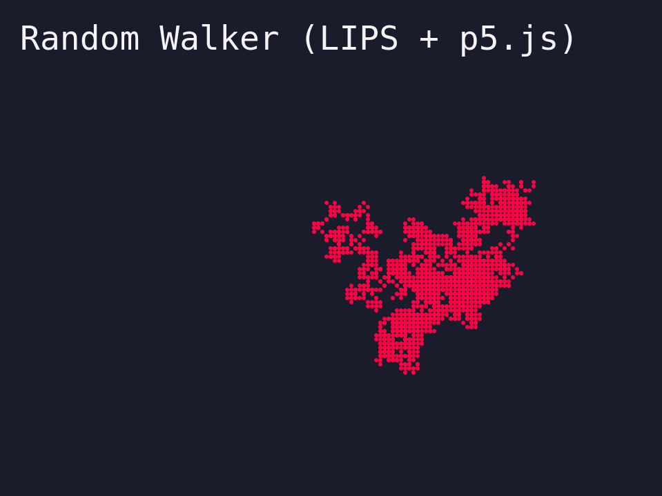

For the moment I settled on a language to use for my exploration of the Nature of Code: I'm going to be using LIPS Scheme, which can be found at https://lips.js.org/. It's an interpreted scheme that runs directly in an HTML page. I quite like the syntax of scheme but haven't had any reason to use it since I was in school many years ago. This project, being relatively small in scope, should be a nice use of it. Bonus being I can get more used to scheme and perhaps use it in other contexts like small binary executables with Chicken or other schemes.

The first chapter of Nature of Code, chapter 0, is all about randomness and getting started with the exercises I implemented a random walker with LIPS, which provides a very nice syntax for interacting with javascript.

The source to display this is relatively simple with scheme and p5. By the way, the reason it looks pixelated like this is because I intentionally made the resolution very small and then scaled it up so that it looked this way. I like the retro feel and hope to keep that vibe throughout the other exercises.

```scheme
(define base-width 160)
(define base-height 120)
(define scale-factor 6)
(define screen-width (* base-width scale-factor))
(define screen-height (* base-height scale-factor))
(define walker-x (/ base-width 2))
(define walker-y (/ base-height 2))
(define randomDirections #(-1 0 1))

(define (setup p)
  (p.createCanvas screen-width screen-height)
  (p.background "#1a1c2c")
  (p.fill "#f4f4f4")
  (p.textFont "monospace")
  (p.textSize (* 8 scale-factor))
  (p.text "Random Walker (LIPS + p5.js) " (* 5 scale-factor) (* 12 scale-factor)))

(define (step-walker p)
  (set! walker-x (+ walker-x (p.random randomDirections)))
  (set! walker-y (+ walker-y (p.random randomDirections))))

(define (draw p)
  (step-walker p)
  (p.push)
  (p.scale scale-factor)
  (p.stroke "#ff0044")
  (p.point walker-x walker-y)
  (p.pop))

(new p5
  (lambda (p)
    (set! p.setup (lambda () (setup p)))
    (set! p.draw (lambda () (draw p)))))
```
