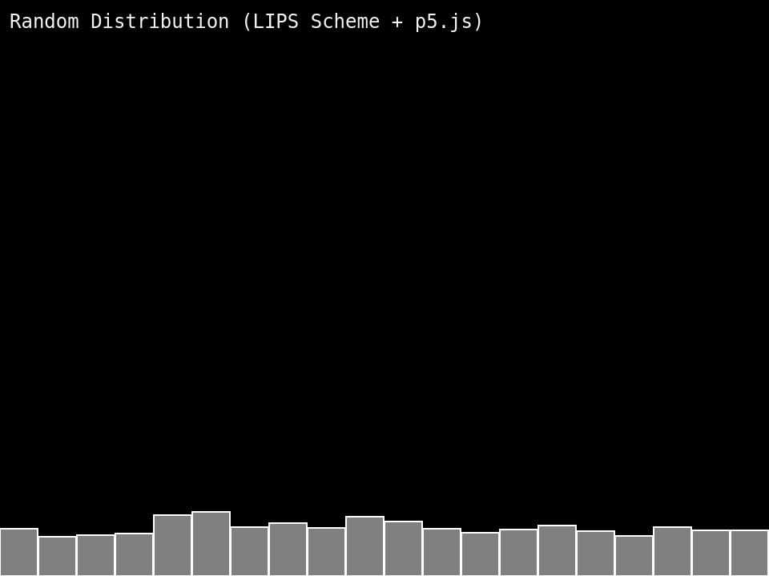

I worked up Example 0.2 in *The Nature of Code* this morning, which displays growing rectangles with vertical height based on a uniform random distribution. 

Created a new `lib.scm` file that I could include that contains utility functions. I had never used the `unfold` function before but managed to use that to create a simple range function that gives me a list of incrementing numbers—this came in handy during this exercise.

When I finished converting the code to Scheme and running it, I noticed an issue I hadn't entirely expected: performance. My fans kicked up when running this example in my browser. I had expected to encounter some performance issues later on when I got to exercises and examples with more data, more movement, and lots of particles, but not this early for just 20 rectangles. LIPS Scheme is fully interpreted I believe, but I didn't expect that to be an issue this early. Will need to re-evaluate tonight what to do moving forward. I don't want to be baking my laptop and listening to my fans all day.

A few other things I noticed:

* **The REPL is really great for playing with functions and learning how they work:** I expected this as I've used REPLs before, but it was pleasant to be able to do this since most of my day job work is in Java and I don't exactly get the opportunity often (I do use JRebel though to speed things up, which is pretty useful).
* **Dynamic friction:** I make a lot of mistakes typing in function names, spelling, putting things in the wrong expression parenthesis, etc.—things that a statically typed language would tell me about before I even got to the browser.
* **Error reporting:** LIPS Scheme doesn't tell me the line number that a program fails on; this is a big one because I need to make sure I move in very small increments, or issues in multiple places might be harder to fix.

Will need to think about whether I want to keep going with this particular project using LIPS Scheme. I like it, but the performance on a project like this probably won't work. Lessons you can only learn by using it, it seems :) ...

Rough code is here: [GitHub - nature-of-code / ch0 / example_i_2_random_distribution](https://github.com/anotherlehner/nature-of-code/tree/main/archived/lips/ch0/example_i_2_random_distribution)
