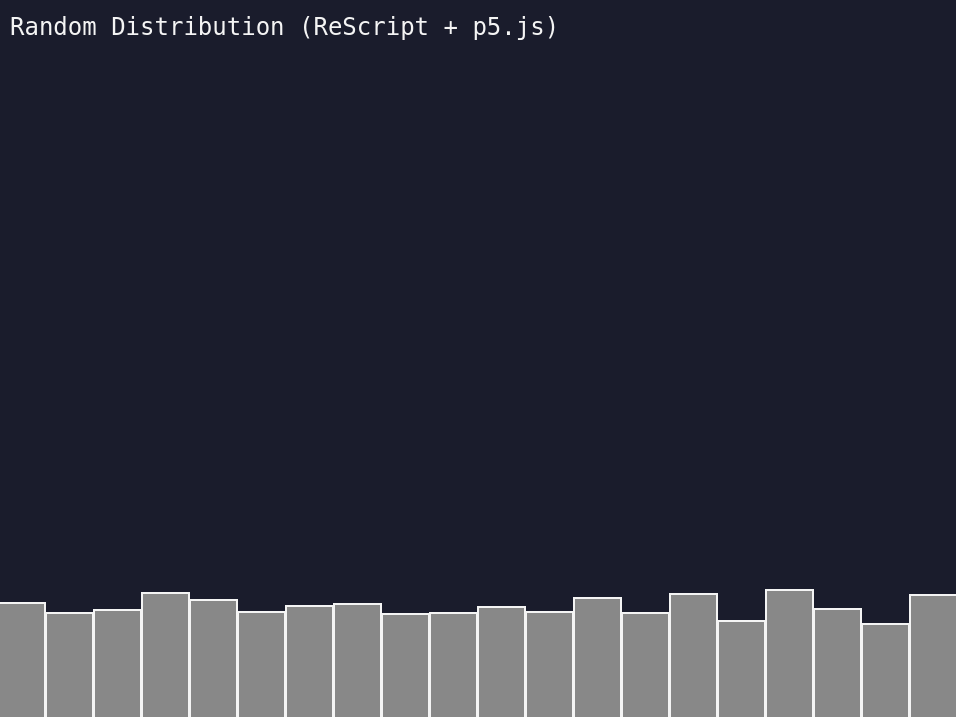

I restarted my work on *The Nature of Code* today and started using ReScript instead of LIPS Scheme. ReScript is a variant of the ML language family and compiles to JavaScript. It's based on OCaml and builds very fast, has good integration with the npm ecosystem, and, although it's similar to JavaScript in some ways with respect to syntax, it's a fairly pleasant middle ground between F#, OCaml, SML, JavaScript, and related languages.

I'm using VS Code as my IDE with the official ReScript extension, which so far has worked very well showing errors in the editor before I go check the browser. I like having the compiler check me for errors before runtime—it's a bias I've had for a long time and I guess I just feel more comfortable in that space. I don't mind the extra burden of having to describe things to it a bit more. ReScript, like other ML languages, has good type inference and I don't have to write a lot of additional static types unless I want to.

Something I do need to do though is handle type signatures... Code is here.

I think the code is a tad verbose in its current form and could probably be a lot shorter if worked on a bit. In the interest of time though—I've been spending weeks getting moving on these initial exercises—I'm going to keep speeding along.

The trickiest bit of the ReScript coding so far, actually both it and LIPS, was getting it plugged into p5.js properly. For ReScript I decided to stick with global mode p5.js and set the window setup and draw functions.

In the below example we need to:

1. Set up the `window` as a type and point it at the JS window (`Browser`)
2. Create some "sets" to assign functions to `setup` and `draw` (`P5`)
3. Finally use them to set some anonymous functions with the code (`Main`)

```rescript
type window
@val external window: window = "window"

// ...

@set external setSetup: (Browser.window, unit => unit) => unit = "setup"
@set external setDraw: (Browser.window, unit => unit) => unit = "draw"

// ...

let main = () => {
  Browser.window->P5.setSetup(() => {
    P5.createCanvas(screenWidth, screenHeight)
    P5.background(#Str(bgColor))
  })

  Browser.window->P5.setDraw(() => {
    P5.background(#Str(bgColor))
    showTitle()
    updateCounts()
    showRectangles()
  })

  P5.initP5Global()
}
```

Ta ta!
