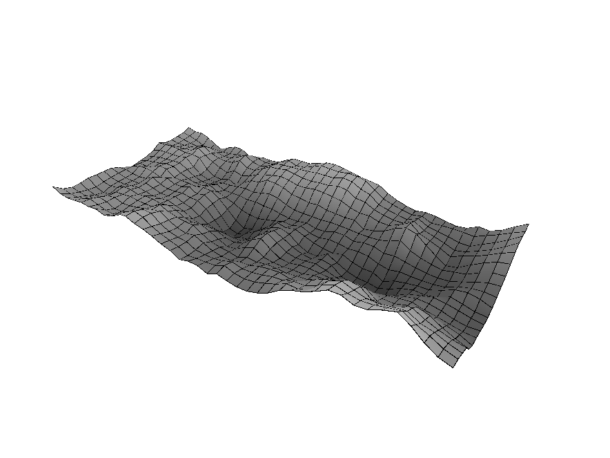

Finished capping off **Chapter 0** of *The Nature of Code*. I've been through most of these examples in various languages, but I think **ReScript** has been my favorite so far. 

I liked playing with both F# and ReScript, but a few key things pulled ReScript to the front for me:

* **Type inference without the friction:** I mostly didn't write types except for externals. Once the externals were taken care of, I barely wrote any types in the sketch code itself. Some externals slowed me down a bit, but once I understood more about ReScript's JS interop, I quickly solved those problems. I got to keep full, sound type safety for most regular coding without explicitly typing everything—it feels dynamic while staying completely type-safe!
* **Blazing fast compiler:** The compiler is *fast* fast.
* **JavaScript similarity:** Okay, this one surprised me. I was actually trying to get away from familiar JS syntax toward something new, but I found having a slightly similar syntax helped me feel more at home with ReScript while keeping a bit of familiarity along the way. Maybe a good gateway drug?
* **Great tooling:** The VS Code plugin works well for the most part, with only a few minor quirks.

### A Minor Stumbling Block (P5.js & Global Scope)

Something less positive that surfaced was less of a ReScript issue and more of a JavaScript/p5.js quirk. 

I kept running into issues where the `floor` function wasn't found in one module but worked in another. After swapping things around, I realized that the p5.js `floor` function (and all of its global functions) aren't available until the global instance has actually been created. I had global variables being initialized before `main()` was called outside of my `setup`/`draw` functions. 

Once I rearranged things to initialize those variables inside `setup()`, everything started working again. This would probably be an issue in plain JS as well, but either way, it resulted in a runtime error—something I always like to avoid if possible.

**Note:** _I converted the `Terrain` code Dan used in the book to ReScript with Gemini's help for this exercise._
