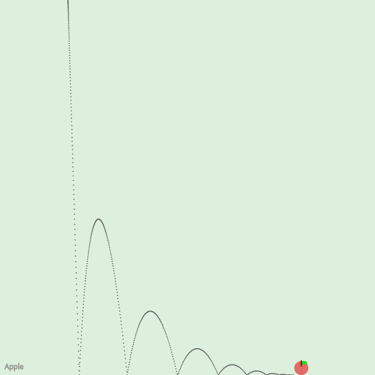

```javascript
class Mover {
  constructor() {
    this.mass = 1;
    this.position = createVector(width / 5, -12);
    this.velocity = createVector(0, 0);
    this.acceleration = createVector(0, 0);
    this.visited = [];
  }

  applyForce(force) {
    let f = p5.Vector.div(force, this.mass);
    this.acceleration.add(f);
  }

  update() {
    this.visited.push([this.position.x, this.position.y]);
    this.velocity.add(this.acceleration);
    this.position.add(this.velocity);
    this.acceleration.mult(0);
  }

  show() {
    noStroke();
    strokeWeight(2);
    fill(225, 15, 20, 150);
    ellipse(this.position.x, this.position.y, 24, 24);

    fill(15, 225, 20, 255);
    ellipse(this.position.x+4, this.position.y-9, 12, 6);

    fill("#663300")
    ellipse(this.position.x, this.position.y-8, 3, 12)

    stroke("#666");
    for(let i = 0; i < this.visited.length; i++) {
      point(this.visited[i][0]-12, this.visited[i][1]+12);
    }
  }

  checkEdges() {
    if (this.position.x > width - 12) {
      this.position.x = width - 12;
      this.velocity.x *= -0.65;
    } else if (this.position.x < 12) {
      this.velocity.x *= -0.65;
      this.position.x = 12;
    }
    if (this.position.y > height - 12) {
      this.velocity.y *= -0.65;
      this.position.y = height - 12;
    }
  }
}


let mover;
let wind;
let doWind = true;
let paused = false;

function keyPressed() {
  if (key == 'w') {
    doWind = !doWind;
  }

  if (key == 'p') {
    paused = !paused;
  }

  if (key == 's') {
    saveCanvas("day1.png");
  }
}

function setup() {
  createCanvas(640, 640);
  mover = new Mover();
  wind = createVector(0.003, 0);
}

function draw() {
  background("#ddf0dd");

  if (!paused) {
    let gravity = createVector(0, 0.1);
    mover.applyForce(gravity);
  
    if (doWind) {
      mover.applyForce(wind);
    }
    mover.update();
  }
  mover.show();
  mover.checkEdges();

  stroke("#999");
  strokeWeight(1);
  noFill();
  text("Apple", 8, height-10);
}
```
