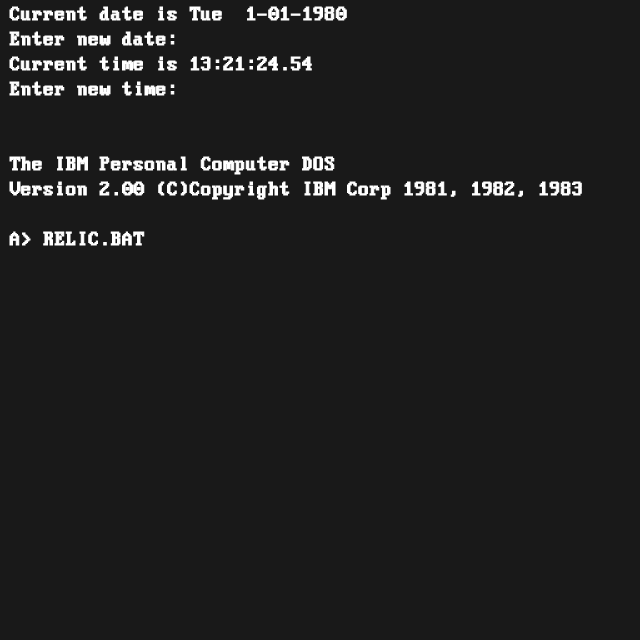

```javascript
let font;

async function setup() {
  createCanvas(640, 640);
  font = await loadFont("./MorePerfectDOSVGA.ttf")

  background("#111");

  stroke(255);
  fill(255);
  textSize(20);
  textFont(font);
  text("Current date is Tue  1-01-1980", 10, 20);
  text("Enter new date:", 10, 45);
  text("Current time is 13:21:24.54", 10, 70);
  text("Enter new time:", 10, 95);
  text("The IBM Personal Computer DOS", 10, 170);
  text("Version 2.00 (C)Copyright IBM Corp 1981, 1982, 1983", 10, 195);
  text("A> RELIC", 10, 245);
  text("L oAd(_g.,.", 10, 295);

  // glitch terminal
  // use a list of ibm 4-color CGA definitions and choose randomly to set stroke
  // draw lines of random length and start
  // draw colored squares
  // draw checkerboards of black and white
  let cga = ["#111", "#fff", "#55ffff", "#ff55ff"]

  // top half
  for(let y=0; y < 290; y+=10) {
    for(let x=0; x < 640; x+=10) {
      if (random() > 0.99) {
        noStroke();
        fill(random(cga));
        rect(x, y, 10, 25);

        if (random() > 0.5) {
          stroke(random(cga));
          line(x, y, x+random(-20,30), y);
        }
      }
    }
  }
  
  // bottom half

  let checker = false;
  for (let y=333; y < 555; y+=25) {
    if (random([0, 0, 1,] == 0)) {
      for (let x=0; x < 640; x+=10) {
        fill(checker === false ? 0 : 255);
        rect(x, y, 10, 25);
        checker = !checker;
      }
    }
    checker = !checker;
  }
  
  stroke(random(cga));
  line(62, 291, 174, 291);
  noStroke();
  for(let y=295; y < 640; y+=10) {
    if (random([0,1,2]) == 2) {
      for(let x=0; x < 640; x+=10) {
        fill(random(cga));
        if (random([0,0,1,1,1]) === 1) {
          rect(x, y, 10, 25);
        }
      }  
    }

    fill(random(cga));
    rect(
      random(0, 640),
      y,
      random(25, 640),
      random(15, 25)
    );

    fill(0);
    rect(
      random(0, 640),
      y,
      random(0, 640),
      random(1, 3)
    )
  }
}

function keyPressed() {
  if (key =='s') {
    saveCanvas("day2.png");
  }
}

function draw() {
  
}
```
