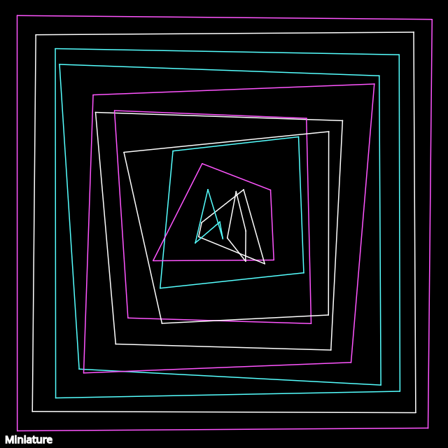

```javascript
function keyPressed() {
  if (key == 's') {
    saveCanvas("day3.png");
  }
}

function setup() {
  createCanvas(640, 640);

  let cga = ["#fff", "#55ffff", "#ff55ff"]
  background(0);

  stroke(255);
  strokeWeight(1.5);
  noFill();
  let nSquares = 14;
  let increment = 25;
  
  for (let i=1; i < nSquares; i++) {
    let [x1, y1] = [i*increment, i*increment];
    let [x2, y2] = [width - i*increment, y1];
    let [x3, y3] = [width - i*increment, height - i*increment];
    let [x4, y4] = [i*increment, height - i*increment];

    x1 += random(-2,2)*i*2;
    y1 += random(-2,2)*i*2;
    x2 += random(-2,2)*i*2;
    y2 += random(-2,2)*i*2;
    x3 += random(-2,2)*i*2;
    y3 += random(-2,2)*i*2;
    x4 += random(-2,2)*i*2;
    y4 += random(-2,2)*i*2;
    
    stroke(random(cga));
    
    line(x1, y1, x2, y2);
    line(x2, y2, x3, y3);
    line(x3, y3, x4, y4);
    line(x4, y4, x1, y1);
  }

  stroke(255);
  textSize(12);
  text("Miniature", 7, height-7);
}
```
