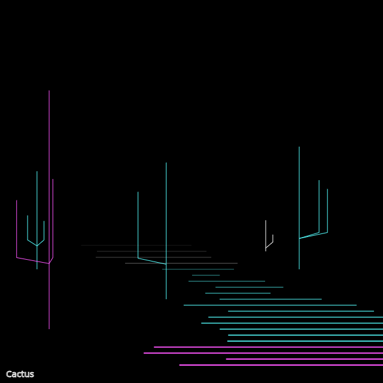

```javascript
const white = "#fff";
const cyan = "#55ffff";
const magenta = "#ff55ff";

function cactus(x,y, baseHeight) {
  // saguaro-like cactus with random number of arms
  if (baseHeight < 100) {
    stroke(white);
  } else if (baseHeight >= 100 && baseHeight < 250) {
    stroke(cyan);
  } else {
    stroke(magenta);
  }
  strokeWeight(1);

  let dy = baseHeight+random(25,100);
  let cHeight = dy;

  // spine
  line(x,y, x, y-dy);

  // number of arms
  const nArms = random(1, 4);

  for(let i=1; i <= nArms; i++) {
    let xpos = x + random(-cHeight/4, cHeight/4);
    // let x1 = x;
    let y1 = y - 0.30*cHeight;
    // let x2 = x1 + random(-cHeight/3, cHeight/3);
    let y2 = y1 - random(cHeight/6, cHeight/2);
    line(xpos, y1, xpos, y2);
    line(xpos, y1, x, y1+10);
  }
}

function setup() {
  createCanvas(640, 640);
  background(0);

  // sketch name
  noFill();
  stroke(255);
  strokeWeight(1);
  textSize(15);
  text("Cactus", 10, height-10);

  
  let cga = [white, cyan, magenta];

  // landscape
  for (let y=400, x=0, z=0; y < 620; y+=10, x+=10, z+=0.1) {
    strokeWeight(z);
    if (y < 580) {
      stroke(y < 450 ? white : cyan);
      line(x*5+random(0,100), y, 200 + random(100,200), y);
    } else {
      stroke(magenta);
      line(x*3 + random(-200, -350), y, x*4, y);
    }
  }

  // cactus
  cactus(444, 420, 25);
  for (let nc = 1; nc <= 3; nc++) {
    cactus(random(0,340), 400 + nc*50, 100*nc);
  }

  cactus(500, 450, 110);
}

function keyPressed() {
  if (key == 's') {
    saveCanvas("day4.png");
  }
}
```
