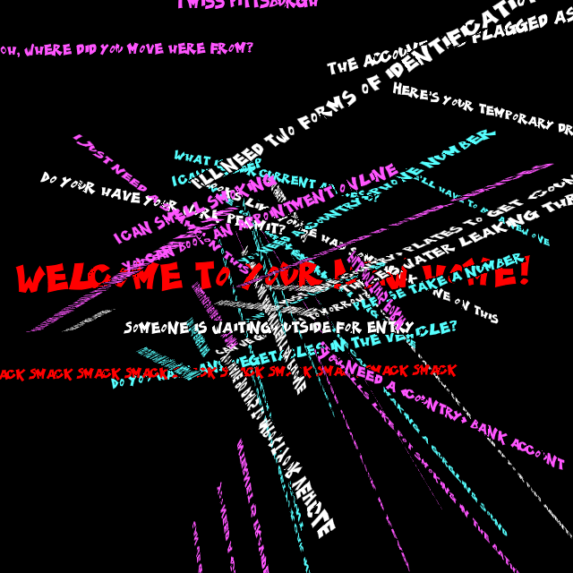

```javascript
const white = "#fff";
const cyan = "#55ffff";
const magenta = "#ff55ff";

async function setup() {
  createCanvas(640, 640, WEBGL);
  background(0);

  let kpFont = await loadFont("KaPow.otf");

  msgs = [
    "Can you give me your passport?",
    "I need this paper stamped by border services",
    "Do your have your work permit?",
    "Do you have a study permit?",
    "You need a <country> phone number",
    "You need a <country> bank account",
    "You need a <country> address",
    "I'll need two forms of identification",
    "I just need a stamp on this",
    "You can book an appointment by phone",
    "You can book an appointment online",
    "Can I have the paperwork provided by your PODS agent?",
    "I do this every day",
    "The account was flagged as fraud",
    "Let's reset your pin",
    "Let's set a pin for your account",
    "Someone is waiting outside for entry",
    "Please have your ID ready",
    "Have a seat and I'll call you when I'm ready for you",
    "Here's your temporary drivers license",
    "You will need to get your car inspected first",
    "You must have <country> plates to get <country> insurance",
    "We'll have to buy a new one",
    "Can we go to IKEA today?",
    "Can we go to IKEA tomorrow?",
    "Can we go to IKEA yesterday?",
    "Fill out this form",
    "Please take a number",
    "The car is making a gurgling sound",
    "You have 90 days to import your vehicle",
    "Do you have any vegetables in the vehicle?",
    "Does your POD contain any hazardous materials?",
    "Does your POD contain any weapons?",
    "Oh, where did you move here from?",
    "What are you studying?",
    "Are you employed?",
    "What is your current address?",
    "You can't use a forwarding mailbox for this account",
    "You will need to get this notarized",
    "Looks like you've had some work done on this",
    "Internet is provided by the apartment complex",
    "There's water leaking through the windows",
    "I can smell grilling outside",
    "Does it smell like smoking?",
    "I can smell smoking",
    "It smells like pot smoking in the bathroom",
    "It smells like someone is cooking tuna",
    "I can't sleep",
    "I heard traffic sounds all night",
    "What is your US address?",
    "I miss Pittsburgh"
  ]

  fill(255);
  noStroke();
  textFont(kpFont);
  textSize(15);
  for(let i=0; i < msgs.length; i++) {
    rotateX(2.0);
    rotateY(1.2);
    textWrap(WORD);
    textSize(random(14, 18));
    fill(random([white,cyan,magenta]));
    text(msgs[i], random(-320,100), random(-320,100));
  }

  push();
  textSize(40);
  fill("#FF0000");
  text("Welcome to your new home!", -300, 0);
  pop();

  push();
  textSize(15);
  fill("#FF0000");
  text("Smack Smack Smack Smack Smack Smack Smack Smack Smack Smack Smack Smack", -450, 100);
  pop();
}

function keyPressed() {
  if (key == 's') {
    saveCanvas("day5.png");
  }
}
```
