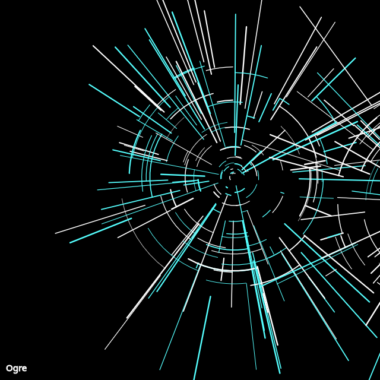

```javascript
const white = "#fff";
const cyan = "#55ffff";
const magenta = "#ff55ff";

function drawImpact() {
  let cx = 0;
  let cy = 0;
  noFill();
  for (let i=0; i < 100; ++i) {
    rotate(random(0.1,PI));
    let lineWeight = random(1.0, 2.5);
    strokeWeight(lineWeight);
    stroke(random([cyan, white]));

    let startX = cx + random(random(5, 25), width/3);
    let startY = cy;
  
    let endX = startX + random(random(5, 25), width/3);
    let endY = cy;
    
    line(startX, startY, endX, endY);

    let arcsize = random(10,400);
    strokeWeight(lineWeight * random(0.5, 1.0));
    arc(cx, cy, arcsize, arcsize, 0, random(0.1, QUARTER_PI));
  }
}

function setup() {
  createCanvas(640, 640);
  background(0);
  stroke(255);
  textSize(15);
  fill(255);
  text("Ogre", 10, height-15);

  translate(random(100, 550), random(100,550), 0);
  drawImpact();

  translate(random(100, 550), random(100,550), 0);
  drawImpact();
}

function keyPressed() {
  if (key == 's') {
    saveCanvas("day6.png");
  }
}
```
