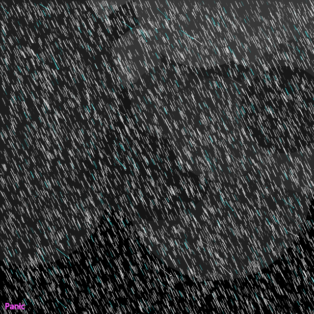

```javascript
// panic

let ice = "#55ffff";
let hot = "#ff55ff";

function setup() {
  createCanvas(640,640);
  background(0);

  noStroke();
  for (let i = 0; i < 30; i++) {
    fill(random(20, 60));
    circle(random(0,width), random(0,height*0.6), random(50, 400));
  }
  
  stroke(255);
  strokeWeight(1);
  noFill();
  for(let i = 0, t = 0.1; i < 100; i++, t += 0.1) {
    strokeWeight(i/100);

    if (random() < 0.5) {
      if (random() < 0.5) {
        fill(255);
        stroke(255);
      } else {
        fill(ice);
        stroke(ice);
      }
      let x = random(0,width);
      let y = random(0,height);
      line(x, y, x-noise(t)-random(10,25), y-noise(t)-random(10,25));
      circle(x, y, random(1, 2));
    }
    
    stroke(255);
    for (let j = 0; j < 100; j++) {
      noFill();
      if (random() < 0.002) {
        stroke(ice);
      }
      let x1 = random(0,width);
      let y1 = random(0,height);
      line(x1, y1, x1 + noise(t) * 10, y1 + noise(t) * 20);
    }
  }

  textSize(16);
  stroke(hot);
  fill(hot);
  text("Panic", 10, height-10);
}

function keyPressed() {
  if (key == 's') {
    saveCanvas("day7.png");
  }
}
```
