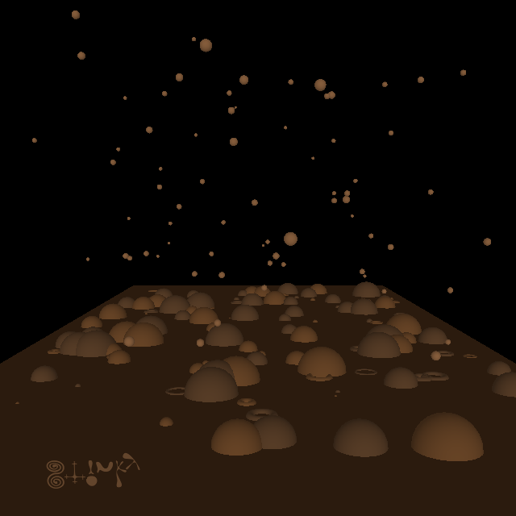

```javascript
// Note: this sketch may throw infinite loop protection errors, I should
// consider converting this to use buildGeometry instead
async function setup() {
  createCanvas(640,640,WEBGL);
  background(0);
  noStroke();
  lights();

  translate(0, 90, 0);
  rotateX(1.5);
  fill("#52341b");
  plane(500,1000);

  for (let i=0; i < 200; i++) {
    push();
    if (random() < 0.7) {
      translate(random(-225, 225), random(-400,400), 0);
      fill(random(["#63452c", "#754d2b"]));
      if (random() < 0.75) {
        sphere(random(0,25));
      } else {
        torus(random(5,10), random(1,3));
      }
    } else {
      translate(random(-225, 225), random(-400,400), random(0,350));
      fill("#986a44");
      sphere(random(2,5));
    }
    pop();
  }

  translate(-110, 465, 18);
  rotateX(1.5);
  textFont(await loadFont("Berzierk-LO7D.ttf"));
  fill("#63452c");
  stroke("#63452c");
  textSize(20);
  text("Stinky", 0, 0);
}

function keyPressed() {
  if (key=='s') {
    saveCanvas("day8.png");
  }
}
```
