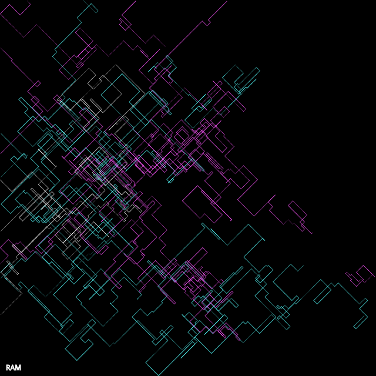

```javascript
let walker;
const white = "#fff";
const cyan = "#55ffff";
const magenta = "#ff55ff";

function setup() {
  createCanvas(640, 640);
  background(0);
  walker = new Walker();

  stroke(255);
  fill(255);
  text("RAM", 10, height - 10);
}

function keyPressed() {
  if (key == 's') {
    saveCanvas("day9.png");
  }
}

function draw() {
  walker.step();
  walker.show();
}

class Walker {
  constructor() {
    this.tx = 0;
    this.ty = 10000;
    this.x = random(0,width);
    this.y = random(0,height);
    this.draw = true;
  }

  step() {
    this.lastx = this.x;
    this.lasty = this.y;
    this.x += noise(this.tx) < 0.5 ? -2 : 2;
    if (this.x > width || this.x < 0) {
      this.x = random(0,width);
      this.draw = false;
      stroke(random([white,cyan,magenta]));
    }

    this.y += noise(this.ty) < 0.5 ? -2 : 2;
    if (this.y > height || this.y < 0) {
      this.y = random(0, height);
      this.draw = false;
      stroke(random([white,cyan,magenta]));
    }
    
    this.tx += 0.07;
    this.ty += 0.07;
  }

  show() {
    if (this.draw) {
      strokeWeight(noise(this.tx));
      noFill();
      line(this.x, this.y, this.lastx, this.lasty);
    } else {
      this.draw = true;
    }
  }
}
```
