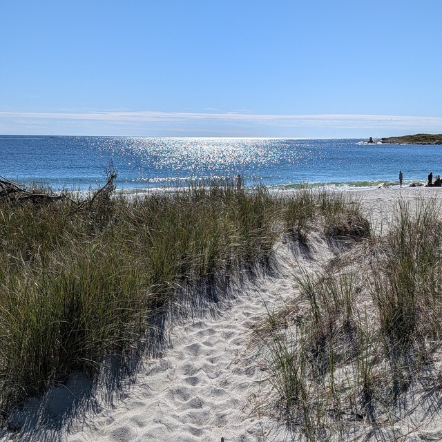
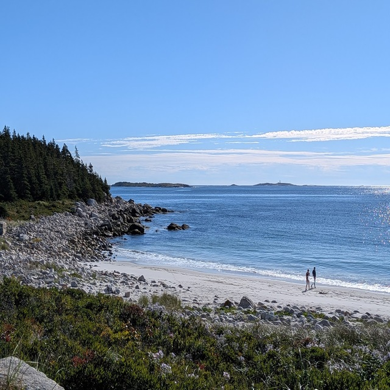
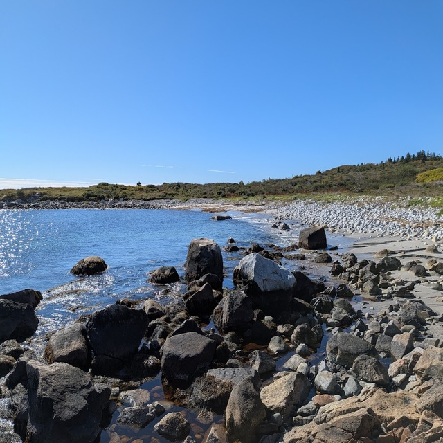
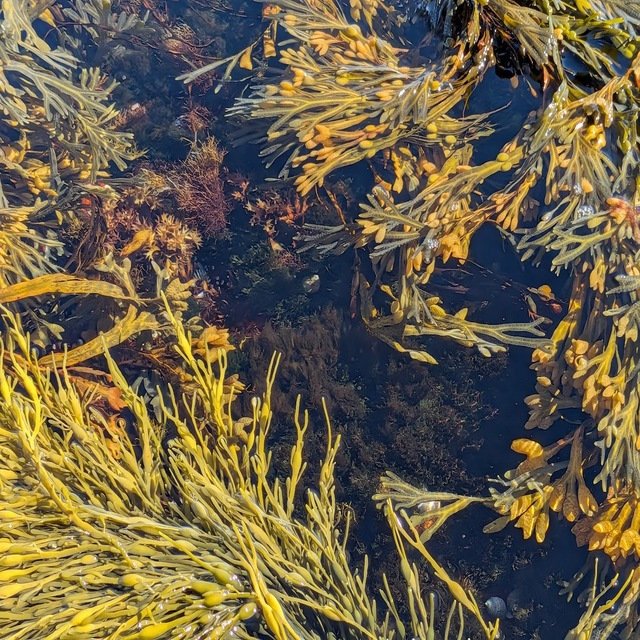
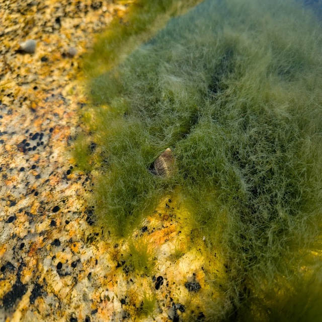
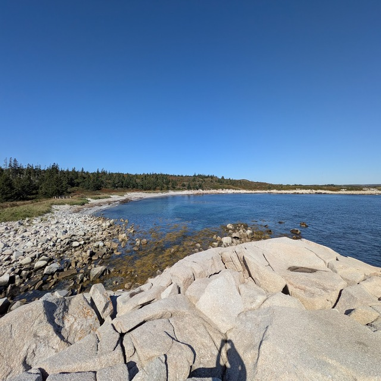
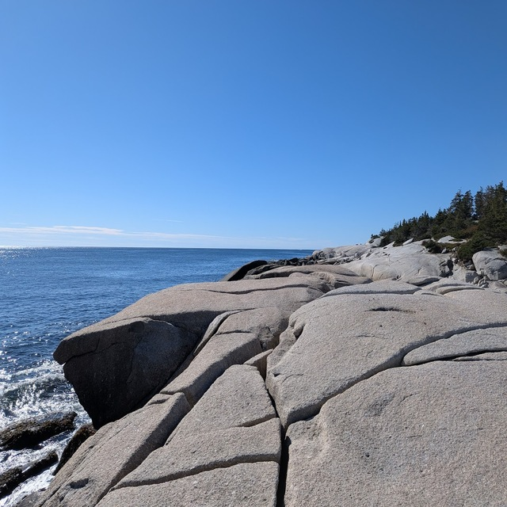

Saturday I drove to Crystal Crescent beach park with Michele, just a 30min drive from our apartment in Halifax. It was a pretty pleasant drive! Thankfully I just turn right out of our apartments and head south and it's pretty much one road the whole way, don't have to go through any urban areas to get there. Going through halifax is a pain with traffic so this made the trip nicer for me as I'm most likely the driver.

By the way, the parking lot is huge, which is nice.

## Beach 1

It's been more than ten years since I've seen a beach. I actually can't remember the last time... maybe when we visited the Oregon coast many years ago. I used to live in California around when I was 9yrs old, for a couple years, and adored the ocean. I dragged my parents to San Juan Capistrano Monument for my birthday in San Diego so I could see the tidepools.

Even before I stepped out of the car I could hear the waves. I got out and remember smiling when I heard the sound clearly. We walked up over the rise and caught our first view of the ocean (above), and it was like I was ten years old again and all that enthusiasm and wonder came back. It helped that the day was absolutely perfect sunny and mid 60s. The water was calm and sparkled with a million points of light. Another view of beach 1:

I think this view is looking North. There are three beaches at Crystal Crescent and rumor has it the third beach is clothing optional so keep that in mind I guess. The trail crosses beach 1 and goes over a couple hills before coming out at beach 2; pretty much right next to beach 1 but separated by a big pile of boulders.

## Beach 2

Beach 2 is probably my favorite of the three, not exactly sure why. It's a little ways away from beach 1 so you need to walk the trail a ways to get there, it's slightly quieter. There's a big pile of rocks on the East side of beach 2 and many Cormorants basking. There are wavy pools or tiny coves of calmish water where I got good views of what was beneath the surface.

In one of the little pools on the large rock (tide was fairly low) I discovered a bunch of snails and this little guy crawling through the sea grass and leaving a trail behind him! I stood there over him and watched for a long moment just seeing him go about his day. There were lots of snail shells all over the rocks and in the pools. I didn't see anything up close under the water besides the snails but I'd be very interested in returning to this spot on a calm day and snorkling around the coastline in a wetsuit.

## Beach 3

Beach 3 is the last major beach of the park per the map but the trail continues beyond. I'm not sure what's beyond but I'm excited to go further next time and explore more. It seems like from the map you could walk all around the peninnsula. As I mentioned before beach 3 is clothing optional and was quite a walk from beach 2 so no worries about being too close to the other beaches.

My favorite part of beach 3 is the large spit of rocks on the Southeastern end, it goes out a ways into the water and is high up. If you don't mind climbing up on top, which I did _immediately_, you can get a fantastic view of the surroundings. To the south is more rocky shoreline...

It was amazing being at a beach again for the first time in over a decade. I can't wait to go back and explore some more. I birding here in the spring could be interesting, saw some Yellow-Rumped Warblers among other things. Also probably a nice plein air painting spot if it's not too busy.

M.
