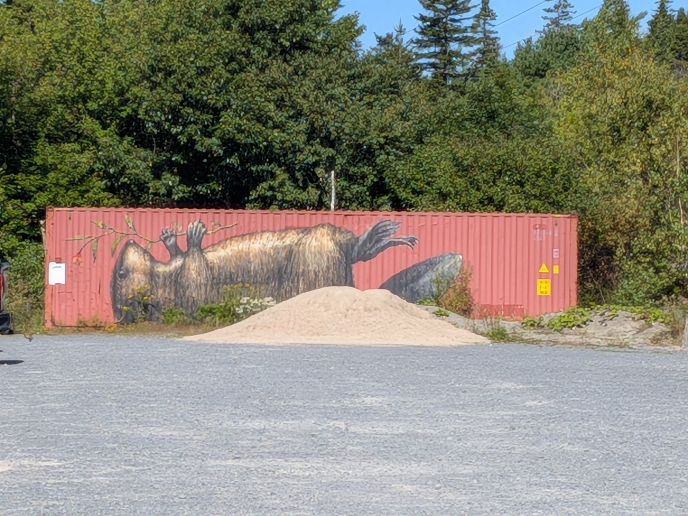
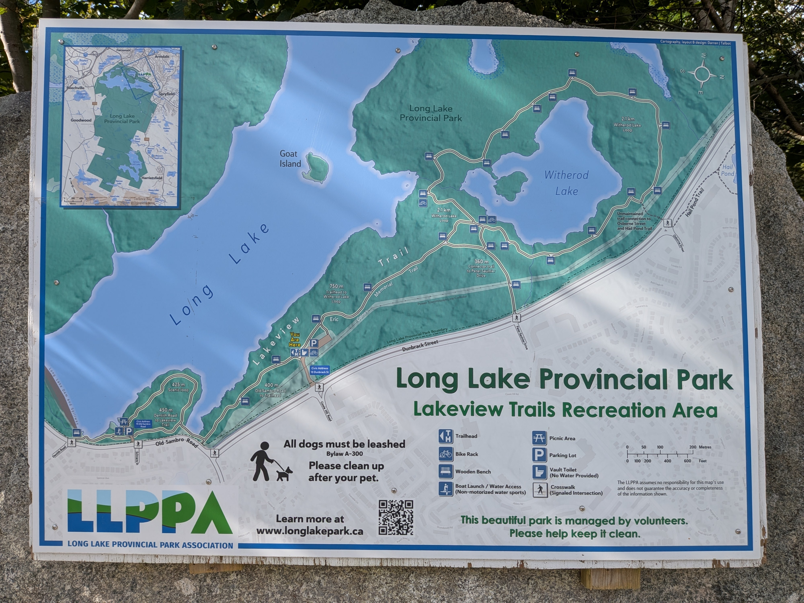
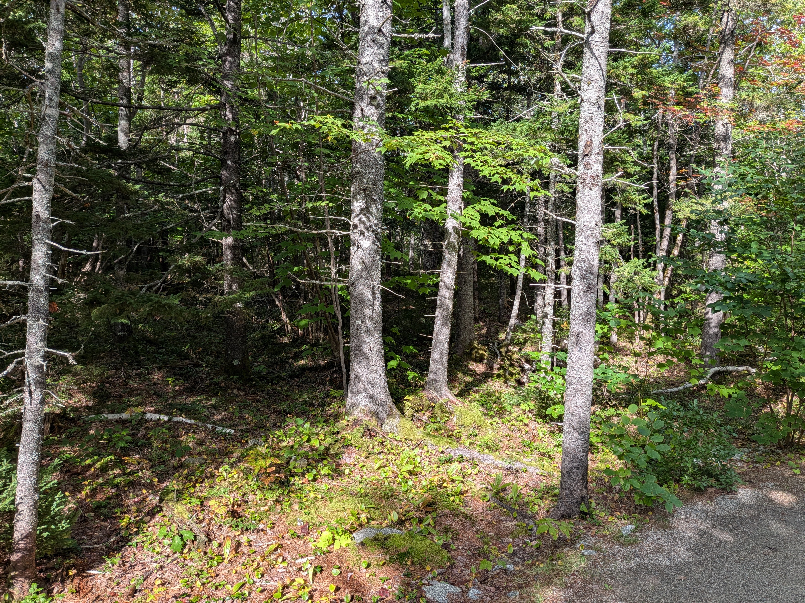
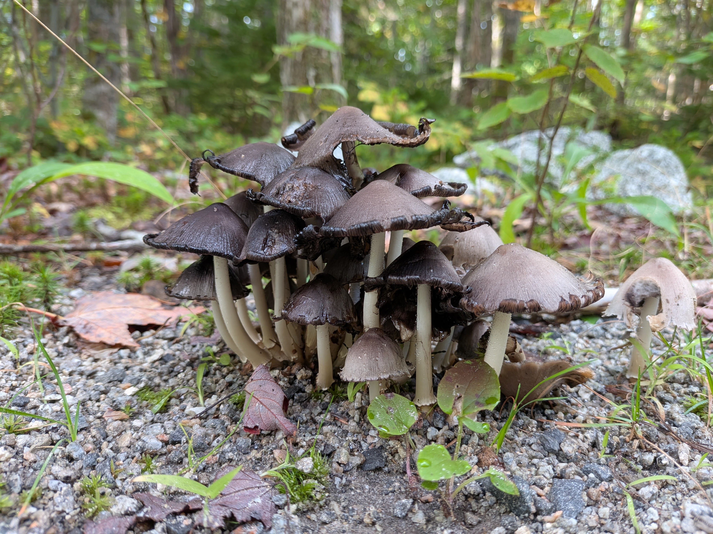
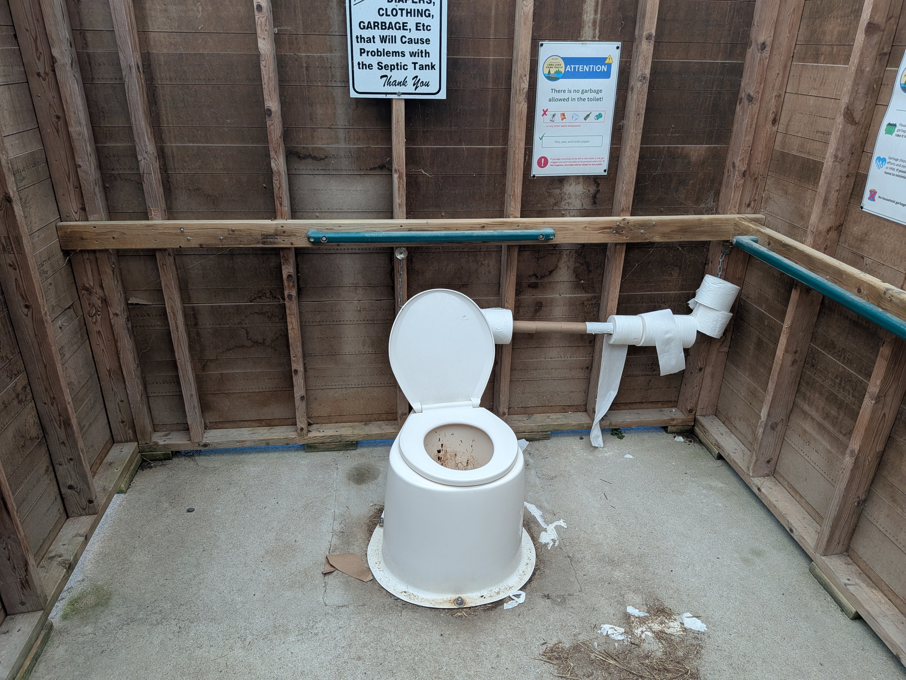
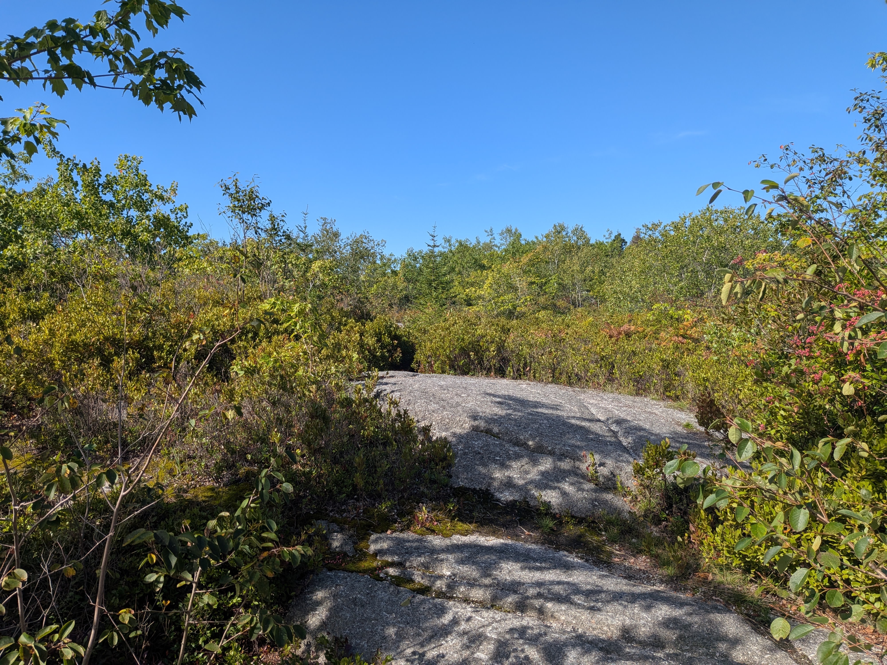
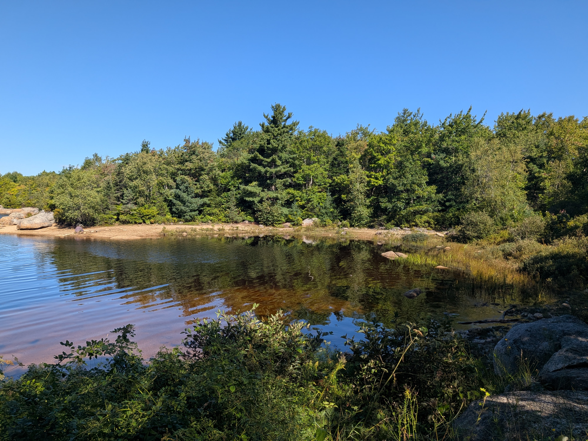

Today I got out for a long walk at **Long Lake Provincial Park** in Nova Scotia (The Lakeview Trails Recreation Area)—it's a trivial 5-minute drive from my apartment in Clayton Park. 

## Parking & Facilities
The main parking lot is on **Dunbrack Street** and is dirt. There's a pit toilet here, which I don't really advise anyone to use unless you have to. I had to—drank far too much water this morning.

The park surrounds Long Lake and Witherod Lake on the north end and then seemingly stretches far south all the way to the ocean. I don't know if that's actually true or not, but it looks like that on Google Maps.

## Witherod Lake Loop
Much of the main trail around Witherod Lake is the same sort of tree/plant mix, and there are benches to sit on short distances apart (along the whole trail, actually). I walked this whole Witherod loop and discovered there was really only one spot I could reach the lake—which I avoided this time, because an aggressive little white dog made me think twice. 

I stuck to the trail and continued. While this loop was a nice walk in the beautiful weather today (**70°F, sunny, mid humidity**), it was fairly boring. I did find loads of different mushroom species, though! 

Here's a picture of one right by the trail:

I returned to the main parking area and used the awful pit toilet again before heading toward the scenic loop.

## The Scenic Loop
The scenic trail is much more what I was hoping to find: **stunning views of the lake and direct access to the shoreline.** 

This part of Canada is just full of granite, and I found absolutely lovely rocky views of the lake that have a lot of promise for plein air painting later on. I guess I didn't mention that above... I'm enjoying my walks, but I'm also scouting for later painting spots with my new gear. *(See my art blog if you're interested in my paintings!)*

Parts of this trail look like the high desert around Flagstaff, Arizona in the States—especially this view, which had me thinking of home:

After this high spot, the trail curved around the edge of the lake and opened up full access to the beach.

I turned back before completing the full scenic loop so I could return later with Michele, so we can both discover the full trail and sights together. But here's another picture of a nice shore spot:

Ta ta!
